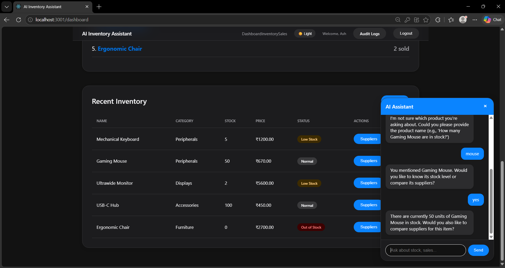
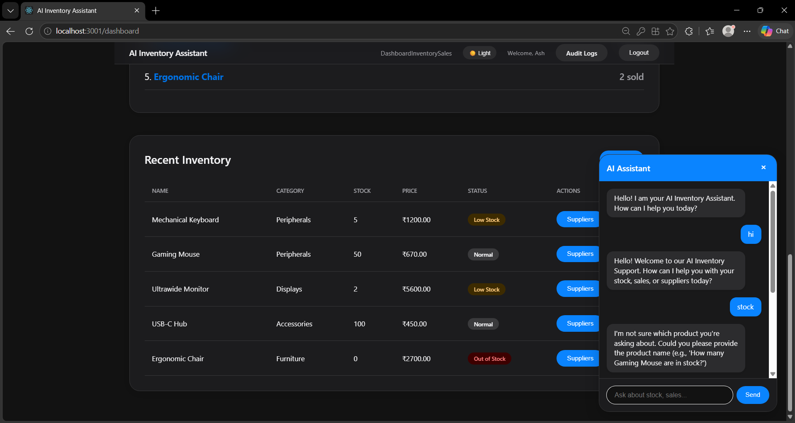
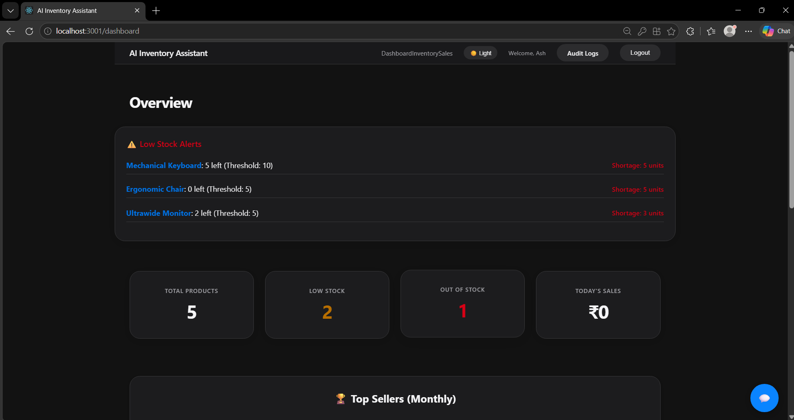
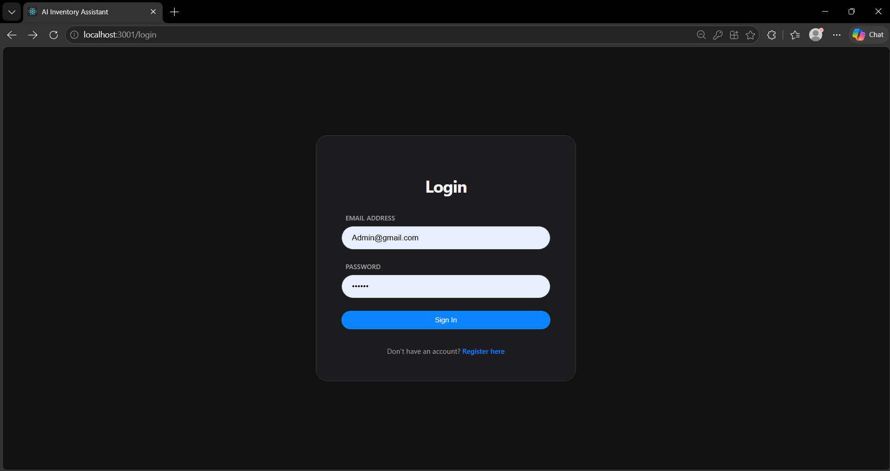

# 📦 AI Inventory Assistant
  
A professional, full-stack inventory and supply chain management system featuring a grounded AI assistant for natural language business intelligence.

## 🚀 Features

- **Apple-Inspired UI/UX**: A luxury, minimalist design system featuring glassmorphism, Bento-style KPI grids, and a professional Dark/Light mode theme across the entire application.
- **AI Inventory Assistant**: Chat with your data! Ask about stock levels, top sellers, or the cheapest suppliers using natural language.
- **Conversational Memory**: The AI remembers the product you are talking about, allowing for natural follow-up questions (e.g., "USB" $\rightarrow$ "Stock?" $\rightarrow$ "Yes").
- **Real-time Analytics**: Professional dashboard with KPI tiles and an elegant, localized Top Sellers leaderboard.
- **Supply Chain Intelligence**: Compare multiple suppliers per product based on price (₹) and delivery speed through a dedicated professional manager.
- **Role-Based Access**: Separate permissions for **Owners** (full control, audit logs) and **Staff** (inventory management).
- **Production Ready**: Fully containerized with Docker for one-command deployment.

## 🛠️ Tech Stack

- **Frontend**: React, React Router, Axios, Recharts, CSS Variables (Theming).
- **Backend**: Node.js, Express, PostgreSQL (`pg-pool`).
- **Security**: JWT Authentication, Bcrypt.js password hashing.
- **DevOps**: Docker, Docker Compose, Nginx.

## ⚙️ Setup & Installation

### 1. Prerequisites
- [Docker Desktop](https://www.docker.com/products/docker-desktop/) installed.
- OR [Node.js](https://nodejs.org/) and [PostgreSQL](https://www.postgresql.org/) installed locally.

### 2. Quick Start (Docker)
The fastest way to get the app running:
```bash
docker-compose up --build
```
The app will be available at `http://localhost:3000`.

### 3. Local Development Setup
**Backend:**
```bash
cd server
npm install
# Create .env file with DB_USER, DB_PASSWORD, DB_NAME, JWT_SECRET
npm start
```

**Frontend:**
```bash
cd client
npm install
npm start
```

## 🤖 AI Architecture
To ensure the app works without requiring an external API key, it uses a **Rule-Based Orchestrator**:
- **Keyword Routing**: Detects intent (e.g., "stock", "cheaper", "sales").
- **Grounded Data**: Calls real backend services to fetch data from PostgreSQL.
- **Contextual Memory**: Uses a session-based memory to handle follow-up affirmations ("yes", "yeah").
- **Localization**: All pricing and currency is displayed in **Indian Rupee (₹)**.

## 📊 Database Schema
- `users`: User accounts and roles.
- `products`: Inventory details and reorder levels.
- `suppliers`: Vendor pricing and delivery times.
- `sales`: Transactional history.
- `chat_logs`: Audit trail of all AI interactions.

## 🖼️ Demo

| Inventory Management | AI Chat Assistant |
| :---: | :---: |
|  |  |

| Dashboard Overview | User Login |
| :---: | :---: |
|  |  |

## 📝 License
MIT
